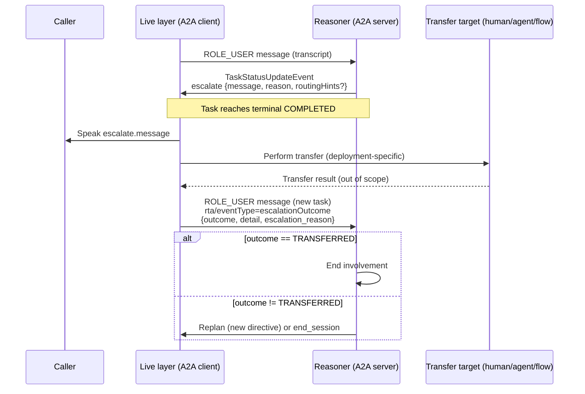

# Escalation Design

Companion to [`../spec.md`](../spec.md) §7, §7.2, and §11: finalizes the neutral
`escalate` payload and the transfer-outcome handshake the spec leaves open.

## 1. Status and scope

This document is normative for v0.1 within the scope stated here. It resolves the
two items spec.md §11 names as open: the escalation payload shape (already
schema'd) and the transfer-outcome handshake (new in this document). It does
**not** define a routing-target schema, a queue/flow/SIP addressing scheme, or a
transfer protocol between the Live layer and any downstream system — those remain
deployment-specific per spec §7.2 and §11.

## 2. Principles

* The Reasoner names *why* a call is escalating and *what to say*; it MUST NOT be
  required to name *where* the call goes. Routing is a Live-layer/deployment
  concern.
* The Live layer is authoritative for whether a transfer actually happened. The
  Reasoner cannot observe the transfer directly and MUST rely on the Live layer's
  report.
* The handshake is asynchronous: `escalate` reaches terminal `COMPLETED` before the
  transfer outcome is known. The outcome arrives later, on a new turn.

## 3. The `escalate` directive payload

Carried as the `DataPart.data` object of a `TaskStatusUpdateEvent` that reaches
terminal `COMPLETED`, per spec §7 and the schema at
[`../schemas/v0.1/directive-escalate.schema.json`](../schemas/v0.1/directive-escalate.schema.json).

| Field | Required | Meaning |
| --- | --- | --- |
| `message` | MUST | Caller-facing text to speak before/around the transfer. |
| `reason` | MUST | Implementation-neutral reason code (§4). Not a routing target. |
| `routingHints` | MAY | Opaque, deployment-specific object. No normative meaning in v0.1. |

```json
{
  "message": "I'll connect you with a specialist who can help with that.",
  "reason": "OUT_OF_SCOPE",
  "routingHints": { "queue": "billing-escalations" }
}
```

`routingHints` is intentionally untyped in the schema. Implementations MAY put
queue IDs, flow IDs, SIP endpoints, or skill tags there; the Reasoner and Live
layer MUST agree on this shape out-of-band. The profile does not validate it and
a Live layer MUST NOT fail if `routingHints` is absent or unrecognized.

**Design choice (non-normative rationale):** `routingHints` is a free-form object
rather than a typed union because routing systems vary too widely (ACD queues,
flow orchestrators, SIP refer targets, human-agent skill routing) to standardize
in v0.1 without coupling the profile to one contact-center architecture. This
mirrors spec §11's explicit deferral.

## 4. Reason vocabulary

`reason` is a short, stable string the Reasoner selects to explain *why* it is
escalating, independent of *how* the transfer is routed. This vocabulary is a
v0.1 design choice, not present in `common.schema.json`; deployments MAY extend
it with additional values, but implementations SHOULD recognize at least these:

| Reason | Meaning |
| --- | --- |
| `OUT_OF_SCOPE` | Request is outside the Reasoner's capability or authority. |
| `USER_REQUESTED_HUMAN` | Caller explicitly asked for a human. |
| `REPEATED_FAILURE` | Reasoner could not resolve the request after repeated attempts (spec §7.2 notes this policy lives in the client/Reasoner, not the protocol). |
| `POLICY_OR_COMPLIANCE` | Escalation required by business or compliance policy. |
| `SENTIMENT_OR_RISK` | Caller distress, risk signal, or de-escalation need. |
| `SYSTEM_LIMITATION` | Tool, workflow, or backend dependency unavailable. |
| `UNSPECIFIED` | Reason not classified. |

An unrecognized `reason` value MUST NOT cause the Live layer to reject the
directive; it SHOULD be treated as `UNSPECIFIED` for local handling and logged
as-is for analytics.

## 5. Transfer-outcome handshake

The Live layer performs the transfer using its own deployment-specific mechanism
(SIP REFER, ACD queue push, internal handoff, etc. — all out of scope here). It
then reports the outcome back to the Reasoner in its **next `ROLE_USER` message**
on the same `contextId`, per spec §7.2. This starts a new turn/task, since the
prior task already reached terminal `COMPLETED` on the `escalate` directive.

### 5.1 Envelope

The report uses the same profile envelope as other messages (spec §5):

* `rta/eventType` = `escalationOutcome`
* A `DataPart` with the fields in §5.2.

This is a new `eventType` value not present in `common.schema.json`'s
`eventType` enum as of v0.1; adding it there is a follow-up schema change this
document flags. Until the schema is updated, implementations SHOULD treat
`escalationOutcome` as a recognized value alongside `directive`, `interruption`,
`conversationHistoryUpdate`, and `clientCapabilities`.

### 5.2 Payload fields

| Field | Required | Type | Meaning |
| --- | --- | --- | --- |
| `outcome` | MUST | enum | One of `TRANSFERRED`, `QUEUED`, `FAILED`, `ABANDONED` (§5.3). |
| `detail` | SHOULD | string | Human-readable, implementation-neutral detail (no routing internals). |
| `escalation_reason` | MAY | string | Echo of the `reason` from the triggering `escalate` directive, for correlation. |
| `interrupted_task_id` | MAY | string | `taskId` of the task that carried the `escalate` directive. |

```json
{
  "outcome": "FAILED",
  "detail": "Target queue reported no agents available.",
  "escalation_reason": "OUT_OF_SCOPE",
  "interrupted_task_id": "task-8821"
}
```

### 5.3 Outcome vocabulary

| Outcome | Meaning | Typical Reasoner response |
| --- | --- | --- |
| `TRANSFERRED` | Call was successfully handed off; a human/agent/flow now owns it. | Reasoner ends its involvement; no further action expected. |
| `QUEUED` | Call is waiting for a target to become available; Live layer still owns media. | Reasoner MAY replan (e.g., offer a callback) or wait for a later report. |
| `FAILED` | Transfer attempt did not succeed (target unreachable, rejected, timed out). | Reasoner SHOULD replan: retry, offer an alternative, or apologize and end. |
| `ABANDONED` | Caller hung up or left before/during the transfer. | Reasoner SHOULD end session bookkeeping; no caller-facing action possible. |

The Reasoner MUST treat any outcome other than `TRANSFERRED` as a signal to
replan or gracefully end, since the prior task already terminated. It MUST NOT
assume `TRANSFERRED` succeeded silently in the absence of a report — if no
report arrives, the session is presumed still owned by the Live layer.

## 6. Sequence



## 7. Open items deferred beyond v0.1

* A normative routing-target schema (queue/flow/SIP addressing) — spec §11.
* Retry/backoff policy after `FAILED` or repeated `QUEUED` reports — left to
  Reasoner/client policy, consistent with spec §7.2's treatment of repeated
  failures as a client concern, not a protocol feature.
* Adding `escalationOutcome` to the formal `eventType` enum in
  `common.schema.json` and publishing a corresponding JSON Schema file
  (`escalation-outcome.schema.json`) alongside the existing directive schemas.
