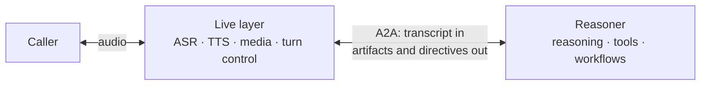

# Agentforce Live A2A Profile Extension

**Status:** Draft v0.1  
**Extension URI:** `https://schemas.salesforce.com/a2a/ext/agentforce-live/v0.1`

## 1. Purpose and scope

This document specifies an optional [Agent2Agent (A2A)](https://a2a-protocol.org/)
profile for real-time, steerable conversations between a **Live layer** and a
**Reasoner**.

The Live layer is the fast, media-facing A2A client: it owns the caller
connection, ASR, TTS, turn-taking, and interruption handling. It may run a
conversational model of its own, handle some utterances locally, and send the
Reasoner a turn when it needs reasoning, a lookup, or an action; a Live layer
without a model relays every utterance. The Reasoner is the slow-thinking A2A
server: it reasons, invokes tools and workflows, and produces output and
directives that steer the Live layer.

The v0.1 boundary is **text in; text and directives out**. Audio and video bytes do
not cross this A2A boundary. The profile uses existing A2A messages, task states,
artifacts, status updates, metadata, and data parts; it defines no new RPC methods
or task states.



## 2. Normative language

The key words **MUST**, **MUST NOT**, **SHOULD**, **SHOULD NOT**, and **MAY** are
to be interpreted as described by RFC 2119 and RFC 8174.

## 3. A2A mapping

| Conversational concept | A2A representation                                    |
| ---------------------- | ----------------------------------------------------- |
| Call or session        | `contextId`                                           |
| User turn              | One `Task` / `taskId`                                 |
| User transcript        | `ROLE_USER` `Message` with a `TextPart`               |
| Spoken response        | `TaskArtifactUpdateEvent` artifact chunks             |
| Conversation control   | `TaskStatusUpdateEvent` with a profile `DataPart`     |
| End of a normal turn   | Terminal `COMPLETED` state                            |
| Barge-in               | An `interruption` profile message                     |
| Cancel                 | `tasks/cancel` plus an `interruption` profile message |

A new message with no `contextId` begins a session; the Reasoner creates and
returns the `contextId`. A message with an existing `contextId` continues that
session. Each turn the Live layer sends starts a new task under the session. A
Live layer that relays every final ASR utterance sends one turn per utterance. A
Live layer with its own conversational model handles some utterances locally and
sends a turn when it needs the Reasoner, carrying the conversation on that turn.

The exception is input collected for an `INPUT_REQUIRED` task: it continues the
same `taskId`, or arrives as a new turn that references it.

The Live layer MAY send a turn while a task of the same context is still in
flight; sending a turn is not a cancel, and whether the Reasoner queues the new
turn or runs it alongside is its own choice. The turn MAY carry an
`interruption` for the running task, which stops its response but not its running
tools and workflows.

The Live layer SHOULD provide these correlation identifiers in metadata:

| Identifier    | Metadata key        | Purpose                                        |
| ------------- | ------------------- | ---------------------------------------------- |
| Turn          | `afl/turnId`        | Mirrors `taskId` for simple joins              |
| Interaction   | `afl/interactionId` | Per-turn analytics key; echoed by the Reasoner |
| Request chunk | `afl/requestGuid`   | Chunk-level correlation                        |

## 4. Discovery, transport, and activation

The Reasoner MUST publish an Agent Card at `/.well-known/agent-card.json`. It
MUST advertise this extension under `capabilities.extensions` and SHOULD offer a
session-scoped, full-duplex WebSocket JSON-RPC interface. HTTP/SSE and gRPC MAY be
offered as compatible fallback bindings.

```json
{
  "name": "ExampleReasoner",
  "version": "0.1.0",
  "url": "wss://reasoner.example.com/a2a/v0.1/{agentId}",
  "preferredTransport": "json-rpc-2.0-websocket",
  "capabilities": {
    "streaming": true,
    "extensions": [{
      "uri": "https://schemas.salesforce.com/a2a/ext/agentforce-live/v0.1",
      "description": "Realtime conversation directives",
      "required": false,
      "params": {
        "directiveTypes": [
          "collect", "confirm", "update", "transfer", "end"
        ]
      }
    }]
  }
}
```

Agent Card transport field names vary among A2A revisions: implementations using
the current shape SHOULD use `supportedInterfaces`; implementations targeting A2A
0.3 MAY use `preferredTransport` and `additionalInterfaces`. The selected A2A
baseline MUST be stated by the implementation.

### 4.1 Extension negotiation

The client requests this extension in the `A2A-Extensions` header during the
WebSocket upgrade (or on the first request for another binding). The server echoes
the subset it activates in its `A2A-Extensions` response header. Some A2A 0.3
implementations use the compatibility spelling `X-A2A-Extensions`.

An echoed URI means the extension is active for the session. If it is not echoed,
the client MUST use the fallback behavior in section 9. The extension is optional:
Agent Cards MUST set `required` to `false` for v0.1.

### 4.2 Client directive capabilities

The Agent Card lists directive types the Reasoner can emit. A Live layer MAY
declare a narrower supported set immediately after activation with a `ROLE_USER`
message tagged `clientCapabilities`:

```json
{
  "role": "ROLE_USER",
  "metadata": {
    "https://schemas.salesforce.com/a2a/ext/agentforce-live/v0.1/eventType": "clientCapabilities"
  },
  "parts": [{
    "data": { "directiveTypes": ["collect", "update", "end"] }
  }]
}
```

The effective directive set is the intersection of the Agent Card list and this
client list. The Reasoner MUST emit only effective types. If no capability message
is sent, it MAY assume the client supports the full Agent Card list. When a needed
directive is unsupported, the Reasoner SHOULD express the result through a
supported conversational output where possible; otherwise it MUST fail the task.

## 5. Profile envelope and ordering

All profile-specific payloads use the extension URI as a metadata-key prefix. In
examples, `afl/` abbreviates
`https://schemas.salesforce.com/a2a/ext/agentforce-live/v0.1/`.

| Metadata key        | Required on                           | Meaning                                                                                                    |
| ------------------- | ------------------------------------- | ---------------------------------------------------------------------------------------------------------- |
| `afl/eventType`     | Profile messages/events               | `directive`, `context`, `interruption`, `conversationHistoryUpdate`, `clientCapabilities`, or `sessionEnd` |
| `afl/directiveType` | Directive events                      | Directive name from the negotiated set                                                                     |
| `afl/sequenceId`    | Artifacts and directive status events | Monotonic, turn-scoped ordering key                                                                        |
| `afl/textForm`      | Spoken `TextPart`                     | `normalized` or `transcript`                                                                               |
| `afl/renderMode`    | Spoken `TextPart` (optional)          | `paraphrase` (default) or `verbatim`                                                                       |

The Reasoner MUST assign a monotonic `afl/sequenceId` to every artifact and
directive event.
The Live layer MUST order artifacts and status events for the same turn by that
value, rather than assuming that separate A2A event channels preserve a shared
order. A profile `DataPart` that rides on a turn message carries its
`afl/eventType` in the part's own metadata.

## 6. Turn input and output

### 6.1 User turn

The Live layer sends an ASR-final transcript, or the request its own model
composed for the Reasoner, as `message/stream`, using a `ROLE_USER` `Message`
containing a `TextPart`. The same message MAY carry a `conversationHistoryUpdate`
`DataPart` with the conversation as the Live layer holds it, so the Reasoner reads
the request in context. It MUST NOT send audio bytes under this profile. A message
without a task ID starts a turn task; the returned task ID is the identifier for
that turn.

### 6.2 Spoken output

The Reasoner streams user-facing output as `TaskArtifactUpdateEvent` events. One
artifact represents one response. Non-final chunks use `append: true`; the final
chunk sets `lastChunk: true`.

Each spoken chunk SHOULD contain both:

* a `TextPart` tagged `afl/textForm=normalized`, optimized for TTS; and
* a `TextPart` tagged `afl/textForm=transcript`, suitable for history and UI.

An untagged text part is interpreted as transcript. Artifacts or parts SHOULD also
carry sequence and timestamp metadata.

A spoken `TextPart` MAY carry `afl/renderMode`. With `paraphrase`, the default, a
Live layer with a conversational model MAY phrase the text in its own voice and in
the local conversational context. With `verbatim`, it MUST speak the text as
written. A Live layer without a conversational model speaks all text as sent. The
mode applies per part, so one response MAY mix both modes.

To give the Live layer information that the caller does not hear, such as a record
its model can use to answer a follow-up locally, the Reasoner sends a separate
artifact tagged `afl/eventType=context` in the artifact metadata. Its parts SHOULD
be `DataPart`s, so a Live layer that does not know this profile does not speak
them. The Live layer MUST NOT speak a context artifact or add it to the
conversation history as speech. An interruption does not cut a context artifact
short.

After final output, the Reasoner MUST emit terminal `COMPLETED` for an ordinary
completed turn. Reaching a terminal A2A state—not an SDK-specific `final` flag—is
the end-of-turn signal.

## 7. Directives

Every directive is an `afl/eventType=directive` payload on a status event and
MUST have `afl/directiveType` and `afl/sequenceId` metadata:

| Directive  | A2A channel and state        | Meaning                                                                       |
| ---------- | ---------------------------- | ----------------------------------------------------------------------------- |
| `collect`  | Status; `INPUT_REQUIRED`     | Collect structured information, then resume the task or reply with a new turn |
| `confirm`  | Status; `INPUT_REQUIRED`     | Confirm sensitive/destructive-action details, then resume or reply            |
| `update`   | Status; remains `WORKING`    | Tell the caller about a pending action while reasoning continues              |
| `transfer` | Status; terminal `COMPLETED` | Transfer to a human, agent, or flow                                           |
| `end`      | Status; terminal `COMPLETED` | Speak final text and close the session                                        |

`COMPLETED` without a terminal directive is ordinary turn completion. It MUST NOT
be treated as `end`.

### 7.1 Handoff directives

A `collect` or `confirm` status event MUST set the task state to
`INPUT_REQUIRED` and include a `DataPart` describing requested fields or entities,
validators, cancellation behavior, and the response schema. The Live layer owns
the resulting short dialogue. It returns the result as a `ROLE_USER` message on
the same `contextId`, in one of two forms. A Live layer that collected a
structured form sends the data on the same `taskId`, and the Reasoner returns to
`WORKING`. A Live layer whose own model conducts the dialogue may be unable to
fill the form or to tell whether its next turn is the answer; it sends a new turn
that lists the task in `referenceTaskIds`, with the caller's words as a `TextPart`,
the collected data as a `DataPart`, or both, and the Reasoner, holding the
question, answers on the new task and closes the referenced task as the content
warrants. The Reasoner SHOULD accept both forms.

`confirm` supports a two-phase confirmation before a sensitive or
destructive operation. The Reasoner owns idempotent resumption; the Live layer owns
reprompts and caller interaction during the handoff.

### 7.2 Update, failure, and terminal directives

An `update` directive remains `WORKING` and carries a `DataPart` with
`indicatorType`, `text`, and `timestamp`. It MAY also carry `action`,
describing the pending action with an `id` unique within the task, a `name`, a
caller-safe `description`, optional `data`, and `cancelable`. `cancelable: false`
means the action cannot be stopped once started; a destructive action SHOULD be
confirmed with `confirm` before it starts rather than relying on cancellation. A Live
layer with a conversational model MAY use `action` to phrase the update and to
answer the caller's questions about the wait without a new turn.

Failures MUST use the core `FAILED` state. `status.message` SHOULD supply a stable
error code and a safe human-readable message. Transfer after repeated failures is
a client policy, not a protocol feature.

`end` MUST provide `reason`, `text`, `normalizedText`, and
`transcriptText`. Permitted reasons are `CLOSED_USER_REQUEST`, `CLOSED_ACTION`,
`CLOSED_TRANSFERRED`, `EXPIRED`, `ERROR`, and `UNSPECIFIED`. The Live layer speaks
the final text and closes the call/session.

For `transfer`, the Reasoner MUST provide a caller-facing message and an
implementation-neutral reason. Queue IDs, flow IDs, SIP endpoints, and other
routing details are deployment-specific and MUST NOT be required by this profile.
The Live layer performs the transfer and reports its outcome in its next
`ROLE_USER` message so the Reasoner can end or replan.

## 8. Interruption, history backfill, and session end

When barge-in cuts a response short, the Live layer MUST send an
`afl/eventType=interruption` `DataPart` for that task, on the message that starts
its next turn or as a standalone message, containing:

```json
{
  "playedText": "text heard by the caller",
  "plannedText": "full planned response",
  "unspokenText": "remaining response",
  "interruptedTurnId": "<taskId>",
  "interruptedRequestGuid": "<requestGuid>"
}
```

The Reasoner stops the response. Tools and workflows already running continue,
and the task stays `WORKING` until they finish; their result is a new artifact on
the same task, and the task then transitions to `COMPLETED`, at once if none were
running. The next utterance
begins a new task under the same context; v0.1 uses this roll-forward model and
does not roll back partial work.

To stop the tools and workflows as well, the Live layer sends `tasks/cancel` with
the same `interruption` payload. It does so when the result is no longer wanted:
it timed out waiting for the task, the caller asked it to stop, or the session
ended. The Reasoner reports the terminal `CANCELED` status. The cancel is
best-effort: the status SHOULD carry a `DataPart` that lists each pending action
by `id` with an `outcome` of `stopped`, `completed`, or `running`, and the
Reasoner records the outcome of what still runs in the conversation, not on a
later task.

The Live layer is authoritative for what the caller actually heard. It MAY send a
`ROLE_USER` `conversationHistoryUpdate` `DataPart` to backfill a locally handled
turn or an interrupted response, either on the message that starts its next turn
or as a standalone message. The payload is `{"items": [...]}`, in time order. Each
item has an `id`, a `role` (`user` or `assistant`), `content` as a list of
strings, and `createdAt`; a response the caller interrupted is an item with
`interrupted: true` whose content is what the caller heard. The Reasoner adds the
items it has not seen, by `id`, and ignores the rest, so a Live layer may send the
whole conversation each time rather than track what the Reasoner already has.

When the session ends on the Live layer's side, it SHOULD send a `ROLE_USER`
message tagged `afl/eventType=sessionEnd` on the `contextId`, so the Reasoner can
release the session's state.

## 9. Interoperability and graceful degradation

The profile is additive. If the extension is inactive or unknown, both sides MUST
continue using core A2A:

* A profile-aware Live layer consuming a vanilla Reasoner converts ordinary text
  artifacts/messages to TTS and relies on core states.
* A vanilla Live layer consuming a profile-aware Reasoner ignores unknown profile
  metadata, consumes text output, and follows core states.

In degraded mode there are no profile directives, explicit conversational lease
handoff, distinct transfer, history backfill, response interruption, or
explicit end-session action. `COMPLETED` and `INPUT_REQUIRED` remain usable as
core A2A states.

## 10. Security and implementation requirements

Implementations MUST use the Agent Card's declared A2A authentication scheme and
MUST protect WebSocket connections with TLS (`wss`). They SHOULD validate extension
activation before interpreting profile data, validate directive schemas and field
values, bound message and artifact sizes, enforce authorization for handoff and
transfer actions, and avoid placing sensitive caller data in logs or telemetry.

Implementations SHOULD define replay/idempotency behavior using the context, task,
interaction, and request identifiers in section 3.

## 11. Out of scope for v0.1

* Media-carrying A2A (audio/video across this boundary).
* A normative transfer routing-target schema and transfer-result handshake.
* Graceful connection drain, buffering, reconnect, and replay. A future extension
  may define `draining` and `endOfConnection` events, resumability fields, and
  recovery through `tasks/resubscribe` while preserving `contextId`.